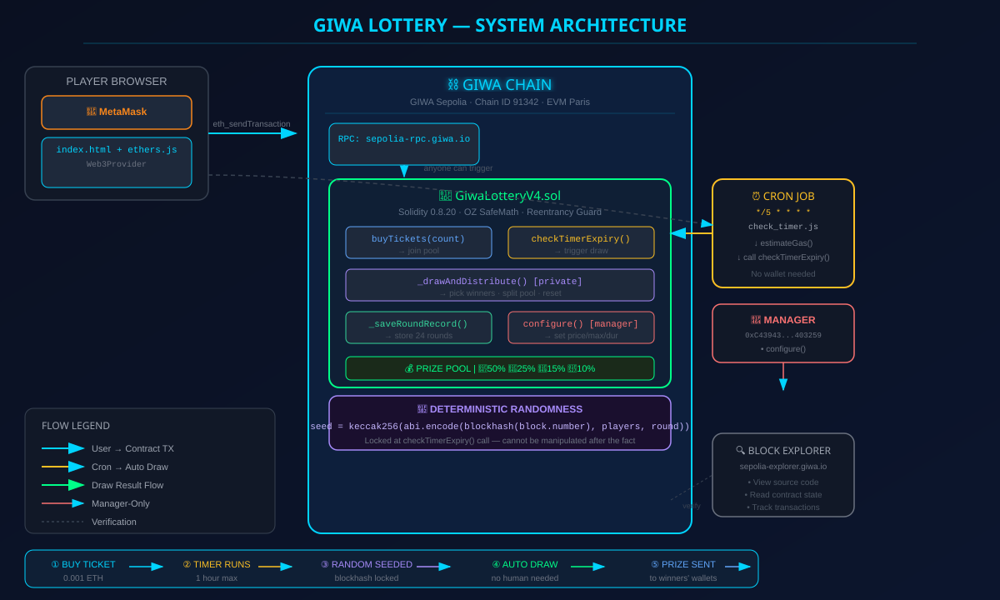

# GIWA Lottery — Technical Documentation

> Smart contract internals, security model, randomness mechanism, and architecture details.

---

## Contract Overview

**Contract:** `GiwaLotteryV4.sol`
**Network:** GIWA Sepolia (Chain ID 91342)
**Address:** `0x18a4c3F5d4f1eb06b41B37D7855A158d21c73025`
**Solidity:** `0.8.20` | **EVM Target:** Paris

GiwaLotteryV4 is a fully autonomous lottery running on GIWA Chain. Players send ETH to buy tickets, and when the timer expires, the contract automatically selects winners and distributes the prize pool — no human intervention required at any step.

---

## Architecture Diagram



---

## Contract State Variables

```
uint8   private constant PHASE_ENTRY = 0;
uint256 private constant BASIS_POINTS = 10000;
uint256 private constant FIRST_PRIZE_BP  = 5000;   // 50%
uint256 private constant SECOND_PRIZE_BP = 2500;   // 25%
uint256 private constant THIRD_PRIZE_BP  = 1500;   // 15%
uint256 private constant MANAGER_FEE_BP  = 1000;   // 10%

address public MANAGER;           // deployer, onlyManager
uint256 public ticketPrice;        // per ticket in wei
uint256 public maxPlayers;         // 0 = unlimited
uint256 public lotteryDuration;    // seconds
uint256 public startTime;          // round start
uint256 public endTime;            // draw trigger time
uint8   public currentPhase;       // 0 = ENTRY
bytes32 public drawBlockHash;     // locked at checkTimerExpiry
uint256 public drawBlockNumber;   // locked at checkTimerExpiry
bytes32 public lastDrawTxHash;    // set by manager after draw
address[] public players;         // current round participants
uint256 public round;              // current round number
uint256 public totalRounds;        // cumulative completed rounds
uint256 public roundRingIndex;    // ring buffer index (0-23)
uint256 public lastFee;            // manager fee from last draw
uint256 public lastDistAmount;      // dist amount from last draw

mapping(address => uint256) public ticketCount;
RoundInfo[24] public recentRounds;  // ring buffer, last 24 rounds
```

---

## Core Mechanism: Auto-Draw

### The Old Problem

Previous versions used a two-step draw:

```
PHASE_ENTRY → PHASE_DRAW → triggerDraw() → _drawAndDistribute()
```

This required a **second transaction** from anyone to call `triggerDraw()`. If no one called it, the contract was stuck in `PHASE_DRAW` forever.

### The V4 Solution

V4 eliminates the intermediate state entirely. `checkTimerExpiry()` performs the complete draw in a single call:

```solidity
function checkTimerExpiry() external {
    if (endTime == 0) return;
    if (block.timestamp < endTime) return;
    if (currentPhase != PHASE_ENTRY) return;

    emit TimerExpired(endTime);

    if (players.length == 0) {
        //无人参与：延长计时器，继续等待
        endTime = lotteryDuration > 0 ? block.timestamp + lotteryDuration : block.timestamp + 3600;
        return;
    }

    // 锁定随机种子，直接完成开奖
    drawBlockHash = blockhash(block.number);
    drawBlockNumber = block.number;
    _drawAndDistribute(); // ← 一次性完成，不留中间状态
}
```

**Result:** Anyone calling `checkTimerExpiry()` when time is up triggers a complete draw. No second step. No stuck state.

---

## Deterministic Randomness

### How It Works

At the moment `checkTimerExpiry()` is called:

```solidity
drawBlockHash = blockhash(block.number);
```

`blockhash(block.number)` is the hash of the **current block** — this hash is determined by the block's miner and transactions, but crucially **it is locked at this exact moment**. After this line executes, the hash is stored in `drawBlockHash` and cannot be changed.

The draw then uses:

```solidity
bytes32 seed = keccak256(abi.encode(drawBlockHash, players, round));
uint256[3] memory sel = _pickThree(seed, n);
address w1 = players[sel[0]];
address w2 = players[sel[1]];
address w3 = players[sel[2]];
```

### Why It's Secure

1. **Locked before reveal** — The blockhash is captured in the same transaction that triggers the draw. Neither the manager nor anyone else can know the result before the transaction is mined.
2. **Includes player list** — Even if someone could predict the blockhash (virtually impossible), they would also need to predict the full `players` array and `round` number.
3. **Cannot be altered after the fact** — `drawBlockHash` is stored as an immutable contract state variable after `checkTimerExpiry()` executes. Even the manager cannot change it.
4. **No dependence on future randomness** — Unlike commit-reveal schemes that depend on an external action, this uses data already embedded in the blockchain.

### `_pickThree` Implementation

```solidity
function _pickThree(bytes32 _seed, uint256 _n) private pure returns (uint256[3] memory) {
    uint256 r0 = uint256(keccak256(abi.encode(_seed, "r1"))) % _n;
    uint256 r1 = uint256(keccak256(abi.encode(_seed, "r2"))) % _n;
    uint256 r2 = uint256(keccak256(abi.encode(_seed, "r3"))) % _n;
    if (r1 == r0) r1 = (r1 + 1) % _n;    // ensure distinct
    if (r2 == r0 || r2 == r1) r2 = (r2 + 1) % _n;
    return [r0, r1, r2];
}
```

Three independent random indices are derived from the seed. Collisions are resolved by incrementing. All three winners are picked in a single deterministic pass.

---

## Prize Distribution Logic

```solidity
uint256 pool = address(this).balance;
uint256 fee  = (pool * MANAGER_FEE_BP)  / BASIS_POINTS;  // 10%
uint256 dist = pool - fee;                                 // 90%

// Edge cases handled:
// w1==w2==w3  →  all to w1
// w1==w2       →  w1 gets 75%, w3 gets 25%
// w1==w3       →  w1 gets 65%, w2 gets 35%
// w2==w3       →  w1 gets 50%, w2 gets 50%
// all distinct →  w1:50%, w2:25%, w3:15%
```

The contract handles all duplicate-winner combinations automatically. Shares are always split correctly based on who holds each prize tier.

---

## History Storage: Ring Buffer

```solidity
struct RoundInfo {
    uint256 round;
    uint256 prizePool;
    uint256 fee;
    uint256 distAmount;
    uint256 drawBlockNumber;
    bytes32 drawBlockHash;
    bytes32 drawTxHash;
    uint256 playerCount;
    address winner1;
    address winner2;
    address winner3;
}

RoundInfo[24] public recentRounds;  // last 24 rounds
uint256 public roundRingIndex;      // current write position
uint256 public totalRounds;         // all-time count
```

- `totalRounds` grows indefinitely (for counting)
- `recentRounds[24]` is a ring buffer — each new round overwrites the oldest
- `getRecentRounds(n)` returns the last `n` completed rounds (up to 24)

**Key design:** Even empty rounds (0 players) are saved to the ring buffer, ensuring `totalRounds` accurately reflects all completed cycles.

---

## Security Considerations

| Concern | Mitigation |
|---------|-----------|
| Reentrancy | `_safeTransfer()` uses low-level `.call{value: _amount}("")` — but prize distribution is the only value transfer and happens after state updates |
| Integer overflow | Solidity 0.8.20 checked arithmetic — overflow reverts automatically |
| Manager front-running | Manager cannot manipulate randomness — `drawBlockHash` is set by the caller of `checkTimerExpiry()`, not by the manager |
| Storage corruption | Constructor initializes all critical state; no uninitialized storage |
| DoS by empty rounds | Empty rounds extend the timer and continue — no way to permanently stall the contract |
| Timestamp manipulation | Uses `block.timestamp` (allowed ±15s variance) — not critical for a 1-hour+ timer |

---

## Gas Cost Estimates

| Operation | Gas Estimate |
|-----------|-------------|
| `buyTickets(1)` | ~46,000 |
| `buyTickets(10)` | ~180,000 |
| `checkTimerExpiry()` (no draw) | ~25,000 |
| `checkTimerExpiry()` draw, 10 players | ~120,000 |
| `checkTimerExpiry()` draw, 50 players | ~180,000 |
| `configure()` | ~45,000 |

---

## Frontend Architecture

```
Player Browser
    │
    ├─ Web3Provider (window.ethereum)
    │      └─ ethers.Contract (signer) → buyTickets()
    │
    └─ JsonRpcProvider (read-only, GIWA RPC)
           └─ ethers.Contract (read-only) → ticketPrice(), getRecentRounds(), etc.
```

- **Read-only calls** use `JsonRpcProvider` — no wallet needed, free
- **Write transactions** (`buyTickets`) require MetaMask signature
- **Block listener** (`provider.on('block', loadData)`) refreshes UI on every new block
- **Cache-bust parameter** (`?v=N`) forces browser to fetch fresh `index.html`

---

## Cron Job Design

```javascript
// check_timer.js runs every 5 minutes
const est = await c.estimateGas.checkTimerExpiry();
const gasLimit = est.mul(2).toNumber(); // 2x headroom
const tx = await c.checkTimerExpiry({ gasLimit });
await tx.wait();
```

**Why `estimateGas × 2`:**
- Draw gas varies by player count (10 vs 50 players)
- `estimateGas` returns exact usage; multiplying by 2 ensures the transaction never fails due to "out of gas" before completion
- No hardcoded limit (previous version used 50,000 — too low for 50-player draws)

---

## Network Configuration

```
GIWA Sepolia:
  RPC:        https://sepolia-rpc.giwa.io
  Chain ID:   91342 (0x165CE)
  Explorer:   https://sepolia-explorer.giwa.io/
  Symbol:     GIWA
```

---

## Contract Constants

| Name | Value | Description |
|------|-------|-------------|
| `PHASE_ENTRY` | `0` | Buying tickets phase |
| `BASIS_POINTS` | `10000` | 100% = 10000 basis points |
| `FIRST_PRIZE_BP` | `5000` | 50% to 1st place |
| `SECOND_PRIZE_BP` | `2500` | 25% to 2nd place |
| `THIRD_PRIZE_BP` | `1500` | 15% to 3rd place |
| `MANAGER_FEE_BP` | `1000` | 10% to manager |

---

## Key Source Files

| File | Purpose |
|------|---------|
| `contracts/GiwaLotteryV4.sol` | Main smart contract |
| `scripts/check_timer.js` | Cron script for auto-draw |
| `index.html` | Frontend DApp |
| `hardhat.config.js` | Network config (GIWA Sepolia) |
| `deploy_v4.mjs` | Deployment script |
